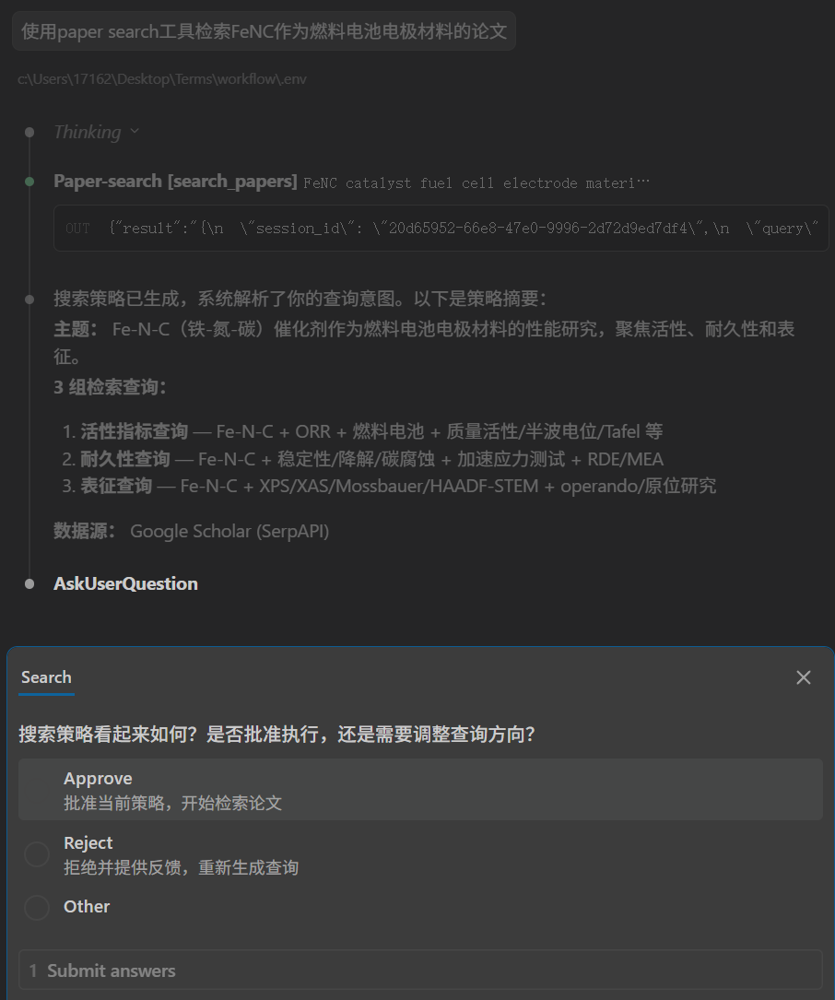
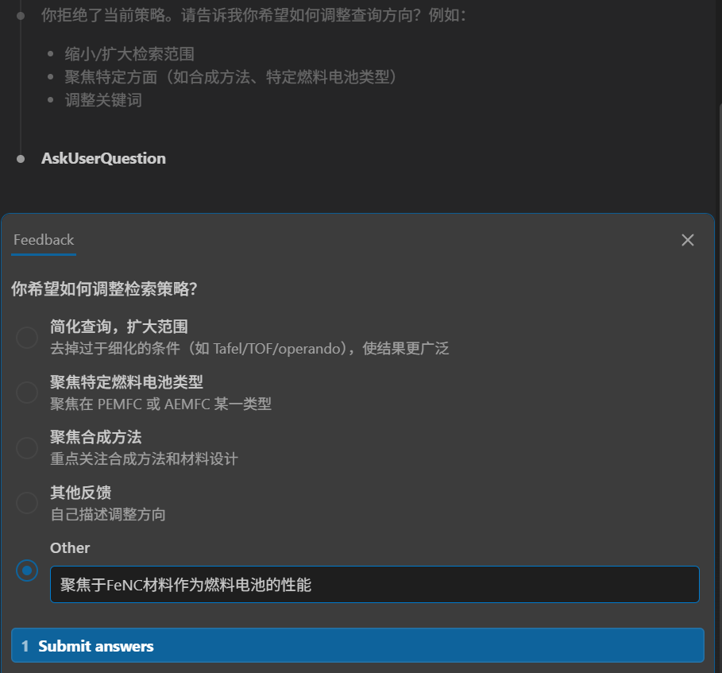
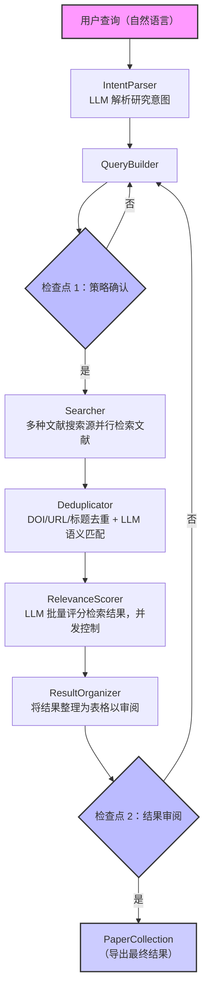

# Paper Search

一个基于 AI 的学术论文搜索工作流系统。用自然语言描述你的研究需求，系统自动完成意图解析、查询构建、多源搜索、去重、相关性评分和结果导出。

[English](./README.md) | **中文**

## 特性

- **自然语言输入、多 LLM 支持** - 使用 OpenAI、Anthropic Claude、Google Gemini 以及所有支持 OpenAI 和 Anthropic Claude 格式的模型。用日常语言描述你要找的论文，工作流就能帮你找到你想要的文章！

  

- **人机协作、迭代优化** - 拒绝或编辑结果可触发<span style="font-weight:bold;">带反馈的精细化搜索</span>。拒绝了一次，结果还让你不满意？那就来<span style="font-weight:bold;">亿次</span>！使用检查点机制介入流程，支持<span style="font-weight:bold;">无上限</span>的策略审批和结果审阅，包括<span style="font-weight:bold;">自定义反馈</span>！

  

  

- **领域自定义、让 AI 更懂你的需求** - 内置泛化 STEM 领域提示词和材料科学领域（生是材料人，死是材料魂！）术语支持，也可自定义。

## 实操演示


## 工作流程



在结果审阅检查点，可以选择 **拒绝** 或 **编辑** 来触发新一轮搜索迭代。用户反馈会传递给 QueryBuilder 以优化下一轮查询。

## 安装

```bash
git clone https://github.com/jadechjin/SCI_Search.git
cd workflow

# 使用 uv 安装依赖
uv sync

# 如需 MCP Server 支持
uv sync --extra mcp
```

**环境要求：** Python >= 3.11

## 配置

将 `.env.example` 复制为 `.env` 并填入相关参数：

```bash
cp .env.example .env
```

### 必需配置

| 变量 | 说明 | 示例 |
|------|------|------|
| `SERPAPI_API_KEY` | SerpAPI 密钥（Google Scholar） | `abc123...` |
| `LLM_PROVIDER` | LLM 提供商 | `openai` / `anthropic` / `gemini` |
| `OPENAI_API_KEY` | OpenAI API 密钥（provider = openai 时） | `sk-...` |
| `ANTHROPIC_API_KEY` | Anthropic API 密钥（provider = anthropic 时） | `sk-ant-...` |
| `GOOGLE_API_KEY` | Google API 密钥（provider = gemini 时） | `AIza...` |

### 可选配置

| 变量 | 默认值 | 说明 |
|------|--------|------|
| `LLM_MODEL` | 提供商默认 | 模型名称 |
| `LLM_TEMPERATURE` | `0.0` | LLM 温度参数 |
| `LLM_MAX_TOKENS` | `4096` | 最大输出 token 数 |
| `LLM_BASE_URL` | - | 自定义端点（兼容 OpenAI 的代理） |
| `DEFAULT_MAX_RESULTS` | `100` | 每次搜索最大结果数 |
| `SERPAPI_MAX_CALLS` | - | 每次工作流运行可发起的 SerpAPI 请求上限（留空表示不限制） |
| `DOMAIN` | `general` | 研究领域（`general` 或 `materials_science` 以及更多自定义领域） |

### 性能调优

| 变量 | 默认值 | 说明 |
|------|--------|------|
| `RELEVANCE_BATCH_SIZE` | `10` | 每批评分的论文数 |
| `RELEVANCE_MAX_CONCURRENCY` | `3` | 最大并发评分批次 |
| `DEDUP_ENABLE_LLM_PASS` | `true` | 启用 LLM 语义去重 |
| `DEDUP_LLM_MAX_CANDIDATES` | `60` | 候选数超过此值时跳过 LLM 去重 |
| `MCP_DECIDE_WAIT_TIMEOUT_S` | `15.0` | `decide()` 等待下一状态的最大秒数 |
| `MCP_POLL_INTERVAL_S` | `0.05` | MCP 会话轮询间隔（秒） |

## 使用方式

### Python（不推荐）

一行代码搜索（自动批准所有检查点）：

```python
import asyncio
from paper_search import search, export_markdown, export_json, export_bibtex

async def main():
    results = await search("钙钛矿太阳能电池效率 2020-2024")

    print(export_markdown(results))   # Markdown 表格
    json_str = export_json(results)   # 结构化 JSON
    bib_str = export_bibtex(results)  # LaTeX 用 BibTeX

asyncio.run(main())
```

自定义配置：

```python
from paper_search import search
from paper_search.config import AppConfig, LLMConfig, SearchSourceConfig

config = AppConfig(
    llm=LLMConfig(
        provider="anthropic",
        model="claude-sonnet-4-5-20250929",
        api_key="sk-ant-...",
    ),
    sources={
        "serpapi_scholar": SearchSourceConfig(
            name="serpapi_scholar",
            api_key="your-serpapi-key",
        ),
    },
    domain="materials_science",
)

results = await search("锂离子电池正极材料", config=config)
```

访问结果数据：

```python
results = await search("石墨烯热导率")

print(f"找到 {results.metadata.total_found} 篇论文")

for paper in results.papers:
    print(f"[{paper.relevance_score:.2f}] {paper.title}")
    print(f"  作者: {', '.join(a.name for a in paper.authors)}")
    print(f"  年份: {paper.year}  期刊: {paper.venue}")
    if paper.doi:
        print(f"  DOI: {paper.doi}")

# 统计分面
print(f"按年份: {results.facets.by_year}")
print(f"按期刊: {results.facets.by_venue}")
print(f"高频作者: {results.facets.top_authors}")
print(f"关键主题: {results.facets.key_themes}")
```

### MCP Server（推荐配合 CC 食用）

将搜索功能暴露为 MCP 工具，供 Claude 等 AI Agent 调用，能自动使用工作流中的所有功能：

```bash
uv sync --extra mcp

# 启动 MCP Server（STDIO 传输）
uv run paper-search-mcp
```

Claude Code 或 Claude Desktop 配置（`claude_desktop_config.json`）：

```json
{
  "mcpServers": {
    "paper-search": {
      "command": "uv",
      "args": ["run", "--directory", "此处填写项目地址", "paper-search-mcp"],
      "env": {
        "SERPAPI_API_KEY": "your-key",
        "LLM_PROVIDER": "openai",
        "OPENAI_API_KEY": "sk-..."
      }
    }
  }
}
```

使用兼容代理时，在 `env` 中添加 `"LLM_BASE_URL": "https://your-proxy.example.com/v1"`。

**MCP 工具包含：**

| 工具 | 说明 |
|------|------|
| `search_papers(query, domain?, max_results?)` | 启动搜索，返回 session_id + 首个检查点 |
| `decide(session_id, action, data?, note?)` | 提交检查点决策（approve/edit/reject） |
| `export_results(session_id, format?)` | 导出结果（json/bibtex/markdown） |
| `get_session(session_id)` | 查询会话状态和进度 |

### 命令行

用于快速测试的最小命令行入口（自动批准所有检查点）：

```bash
python -m paper_search "钙钛矿太阳能电池"
```

## 导出格式

### JSON

包含论文、元数据和统计分面的完整结构化数据：

```python
from paper_search import export_json
json_str = export_json(results)
```

### BibTeX

LaTeX 引用格式：

```python
from paper_search import export_bibtex
bibtex_str = export_bibtex(results)
```

```bibtex
@article{wang_2023_perovskite,
  author = {Wang Lei and Zhang Wei},
  title = {{Perovskite Solar Cells}},
  year = {2023},
  journal = {Nature Energy},
  doi = {10.1234/test},
}
```

### Markdown

表格格式，方便分享：

```python
from paper_search import export_markdown
md_str = export_markdown(results)
```

```
| # | Title | Authors | Year | Venue | Score |
|---|-------|---------|------|-------|-------|
| 1 | Perovskite Solar Cells | Wang Lei, Zhang Wei | 2023 | Nature Energy | 0.95 |
```

## 数据模型

```python
class Paper:
    id: str
    title: str
    authors: list[Author]       # Author(name, author_id?)
    year: int | None
    venue: str | None
    doi: str | None
    source: str                  # 如 "serpapi_scholar"
    relevance_score: float       # 0.0 ~ 1.0
    relevance_reason: str
    tags: list[PaperTag]         # method / review / empirical / theoretical / dataset
    citation_count: int
    full_text_url: str | None

class PaperCollection:
    metadata: SearchMetadata     # 查询信息、策略、总数
    papers: list[Paper]          # 按相关性排序
    facets: Facets               # by_year, by_venue, top_authors, key_themes

class SearchStrategy:
    queries: list[SearchQuery]   # 布尔查询列表
    sources: list[str]
    filters: SearchConstraints   # 年份范围、语言等

class ParsedIntent:
    topic: str
    concepts: list[str]
    intent_type: IntentType      # survey / method / dataset / baseline
    constraints: SearchConstraints
```

## 项目结构

```
src/paper_search/
├── __init__.py              # 公共 API: search(), export_*
├── __main__.py              # 命令行入口
├── config.py                # 配置管理（.env 加载）
├── export.py                # 导出（JSON / BibTeX / Markdown）
├── mcp_server.py            # MCP Server（4 个工具）
├── models.py                # Pydantic 数据模型
├── llm/                     # LLM 提供商
│   ├── base.py              # 抽象基类 LLMProvider
│   ├── openai_provider.py
│   ├── claude_provider.py
│   ├── gemini_provider.py
│   ├── factory.py           # 提供商工厂
│   ├── json_utils.py        # JSON 提取（3 步回退）
│   └── exceptions.py        # 异常层级
├── prompts/                 # 提示词模板
│   ├── intent_parsing.py
│   ├── query_building.py
│   ├── relevance_scoring.py
│   ├── dedup.py
│   └── domains/             # 领域特化
│       └── materials_science.py
├── skills/                  # 核心管线技能
│   ├── intent_parser.py     # 自然语言 -> ParsedIntent
│   ├── query_builder.py     # Intent -> SearchStrategy
│   ├── searcher.py          # Strategy -> RawPaper[]
│   ├── deduplicator.py      # 算法 + LLM 去重
│   ├── relevance_scorer.py  # 并发批量评分
│   └── result_organizer.py  # 过滤、排序、分面统计
├── sources/                 # 搜索源适配器
│   ├── base.py              # 抽象基类 SearchSource
│   ├── serpapi_scholar.py   # 通过 SerpAPI 访问 Google Scholar
│   ├── factory.py
│   └── exceptions.py
└── workflow/                # 编排层
    ├── engine.py            # SearchWorkflow（主管线）
    ├── checkpoints.py       # 检查点 / 决策模型
    └── state.py             # 迭代状态管理
```

## 测试

```bash
uv run pytest tests/ -v
```

213 项测试覆盖所有模块：数据模型、LLM 提供商、SerpAPI 适配器、全部 6 个技能、工作流引擎、检查点、导出、库 API、MCP Server 和命令行。

## 许可证

MIT
